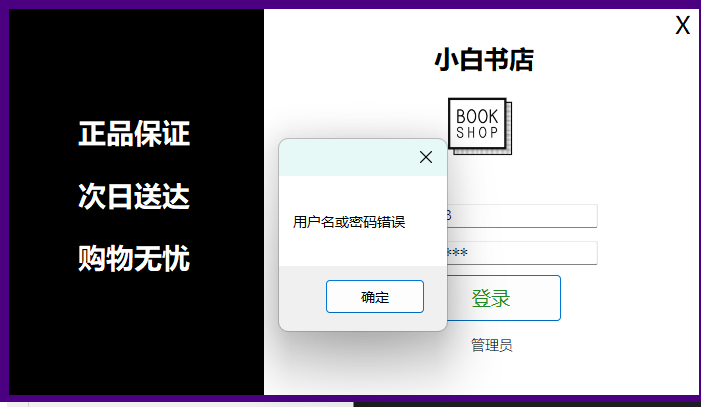
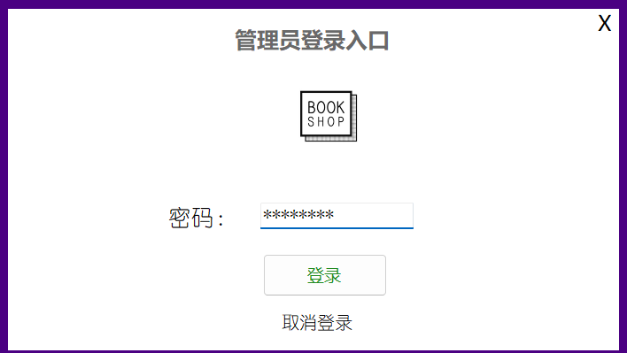
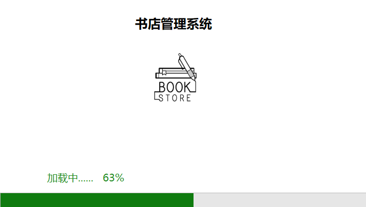
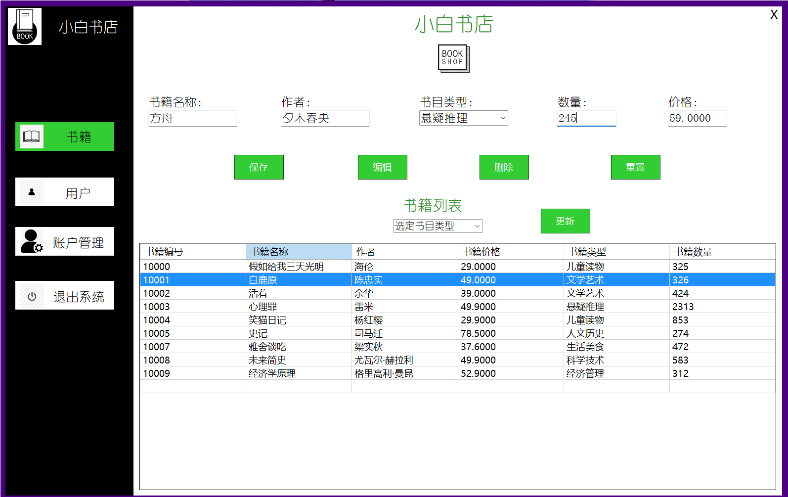
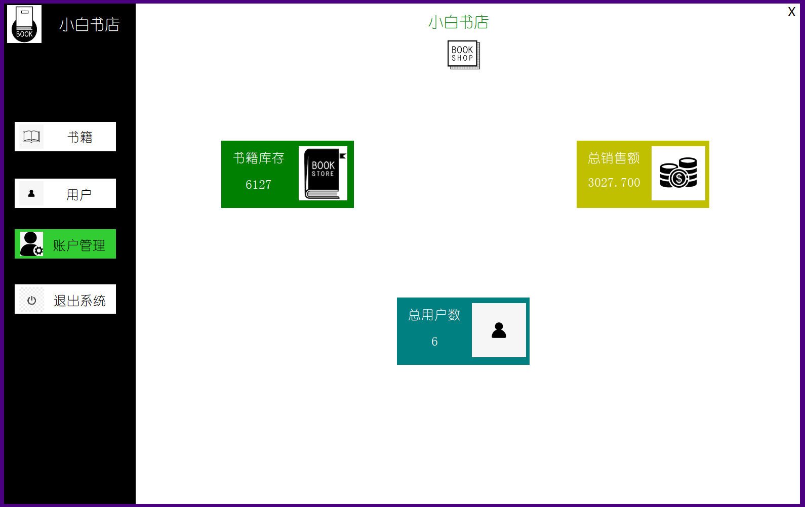

<p align="center">
  
</p>

<p align="center">
  
  
  
  
  
  
</p>

---

## 📖 项目简介

> **WhiteBookShop** 是一个基于 **WinForms + .NET Framework 4.8** 开发的  
> **图书管理 / 书店管理系统**，使用 **SQL Server** 作为后端数据库。  
>  
> 项目适合用于课程设计、WinForms 学习以及数据库综合实践。

---

## ✨ 功能模块

- 📚 图书信息管理（增 / 删 / 改 / 查）
- 👤 用户 / 管理员管理
- 🧾 书籍的购买以及订单打印
- 🔍 用户和书籍的查询，筛选书籍

---

## 🖥️ 技术栈

| 类型 | 技术 |
|----|----|
| 开发语言 | C# |
| UI 框架 | WinForms |
| 运行时 | .NET Framework 4.8 |
| 数据库 | SQL Server |
| 开发工具 | Visual Studio 2022 |

---

## 🗄️ 数据库设计

- 数据库名称：`WhiteBookShop`
- 主要数据表：
  - `BookTB1`（图书信息表）
  - `UsersTB1`（用户表）
  - `BillTB1`（订单表）
- 数据库脚本位于：
```text
/database.sql
```

---

## 🧠 其他说明(碎碎念)

- 这是本人完成的第一个完整项目，是根据B站视频学习的，感谢UP和各位的免费分享😋
- 本系统用于完成我的数据库课设，在课设中我学到了很多，比如ER图，流程图等的绘制，知道了完整的报告该怎么写。
- 本次上传用于记录我的CS历程，感谢各位！

---
## 📸 项目部分截图

<p align="center">
  
  
  
  
  
  
</p>


